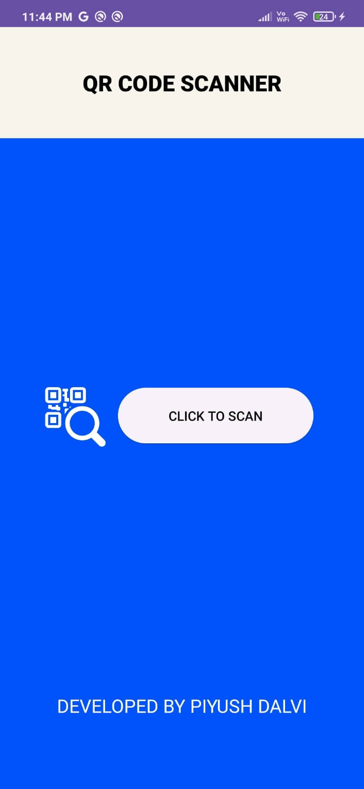
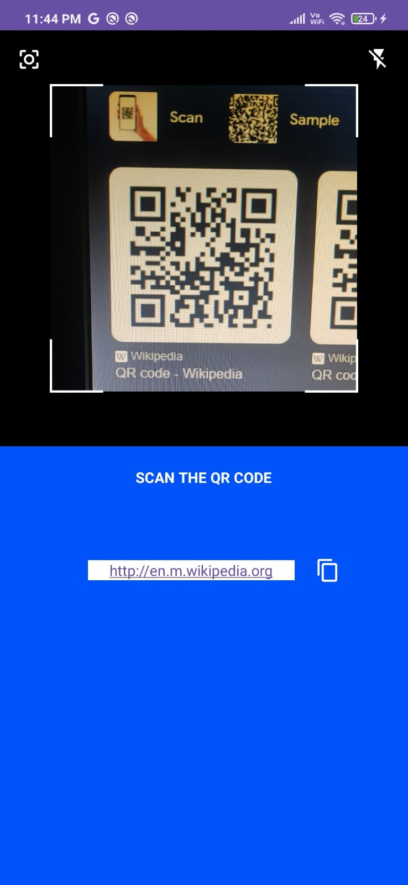

# Scanner App

## Table of Contents

- [Description](#description)
- [Features](#features)
- [Screenshots](#screenshots)
- [Installation](#installation)
- [Usage](#usage)
- [Contributing](#contributing)
- [License](#license)

## Description

The QR Scanner App is a lightweight and easy-to-use mobile application built with Kotlin and XML. It allows users to quickly scan and decode QR codes to access relevant information or perform specific actions. Whether it's opening a URL, extracting contact details, or reading text data, the QR Scanner App delivers a seamless scanning experience.

## Features

- Quick Scan: Instantly scan and decode QR codes using your smartphone camera.
- Multiple Formats: Supports various QR code types, including text, URL, contacts, Wi-Fi, and more.
- Copy & Share: Easily copy or share scanned content with others via email, messaging apps, or social media.
- Flashlight Support: Toggle the flashlight on/off for scanning in low-light conditions.
- Vibration Feedback: Get instant feedback upon successful scanning.
- User-Friendly Interface: Simple design with smooth navigation.
- Secure & Offline: All QR code data is processed on your device for privacy.

## Screenshots

## Usage

1. Launch the QR Scanner App on your mobile device.
2. Align the QR code within the scanner frame.
3. The app will automatically decode the QR code and display the information.
4. Review the scanned result and perform relevant actions like opening a URL, copying the text, or saving contact details.
5. Access past scans in the history log for convenience.

## Contributing

We welcome contributions to the Scanner App. If you'd like to contribute, please follow these guidelines:

1. Fork the repository.
2. Create a new branch for your feature or bug fix.
3. Make your changes and test thoroughly.
4. Submit a pull request with a clear description of your changes.

